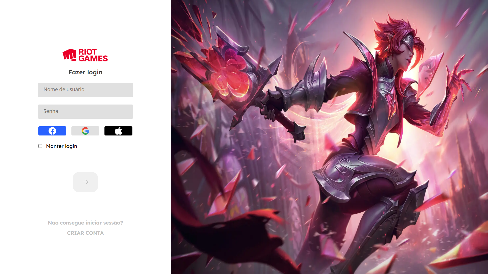
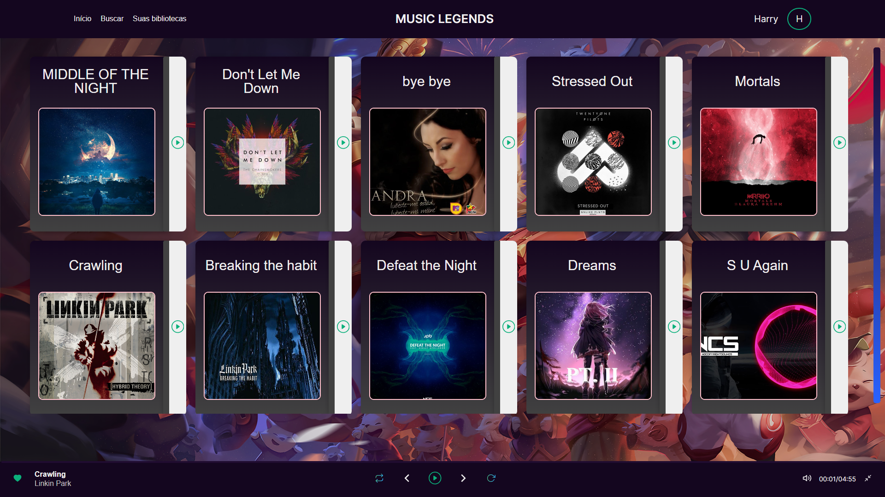
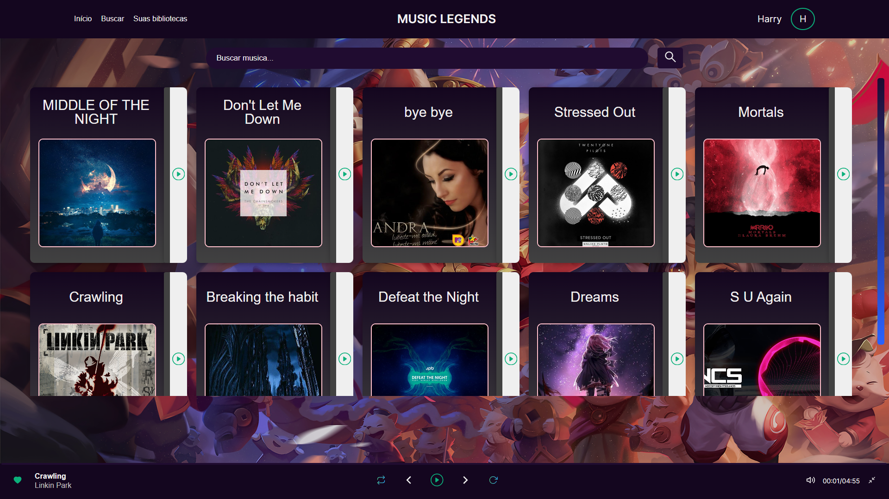
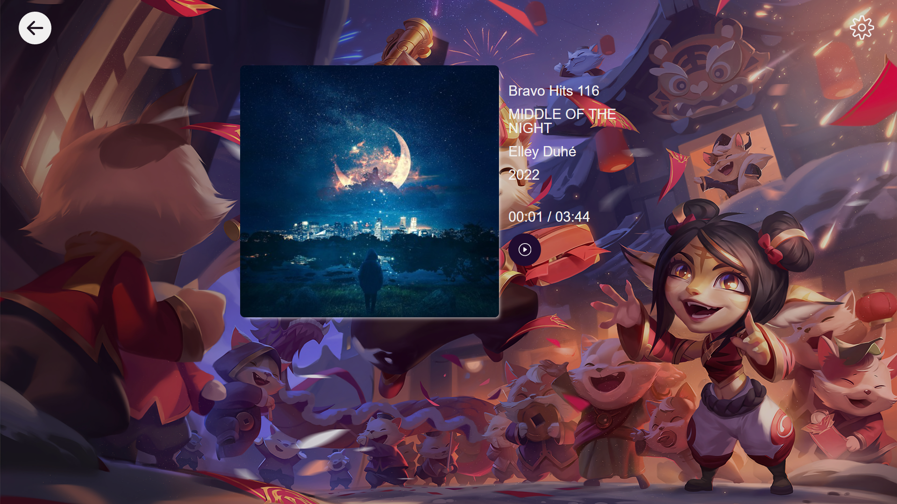
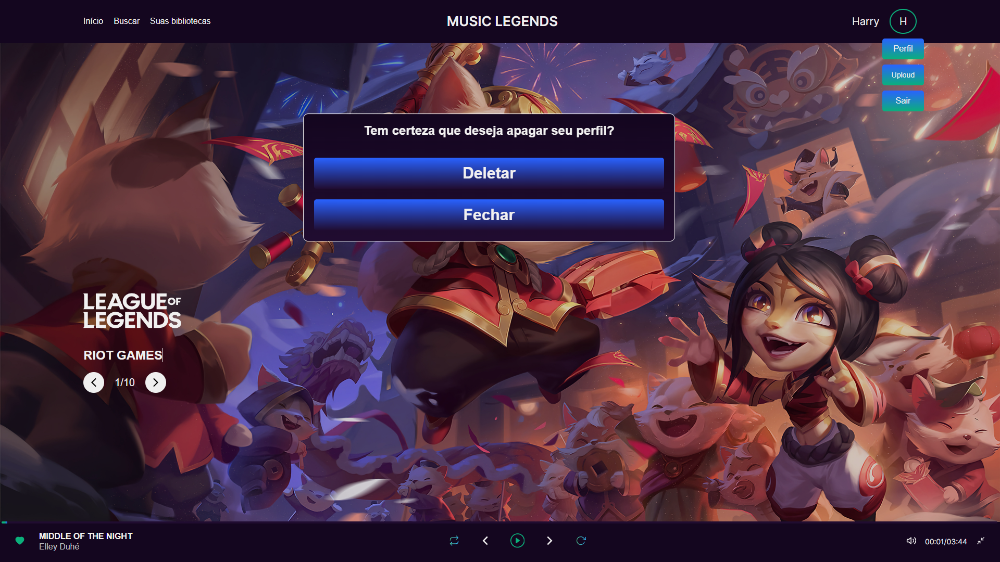

# RiotFy

Para acessar o repositório do Backend, <a href="https://github.com/RichardLimaDxD/RiotFy" target="_blank">clique aqui</a>.

## Seções do projeto

- [Descrição](#✔️-descrição)
- [Funcionalidades](#💻-funcionalidades)
- [Tecnologias](#🔨-tecnologias)
- [Instalação e Execução](#🚀-instalação-e-execução)

## ✔️ Descrição

Riotfy é uma aplicação web sobre músicas com temática de League Of Legends, na qual é possivel reproduzir músicas, pausar, criar um usuário,criar músicas, editar músicas e usuário, e excluir uma música e um usuário.
O figma como algumas partes do designer do projeto não foi feita por mim, <a href="https://www.figma.com/file/ncArmqcunPAxj6t8TMl6uR/Desafios---Codel%C3%A2ndia-(Copy)?type=design&node-id=80254-762&mode=design&t=1nGV82Y291rVWMrK-0" target="_blank">aqui</a> você pode estar encontrando o link do figma do projeto <a href="https://www.figma.com/file/ncArmqcunPAxj6t8TMl6uR/Desafios---Codel%C3%A2ndia-(Copy)?type=design&node-id=80254-762&mode=design&t=1nGV82Y291rVWMrK-0" target="_blank">(Desafio 23)</a>.

## 💻 Funcionalidades

- Cadastro de usuário;

- Login;

- Página inicial;

- Página de busca;

- Página de bibliotecas;

- Página de criação de músicas, apenas admin;

- Página de visualização de música por id;

- Página de edição e exclução de músicas, apenas admin;

- Modal de edição e exclução de usuário;

## 🔨 Tecnologias

- `npm`
- `Vercel`
- `NextJs13`
- `Typescript`
- `Git`
- `Github`
- `Figma`
- `Axios`
- `Sass`
- `Toastify`
- `Hook Form`
- `Nookies`
- `ESLint`
- `Zod`
- `React-dropzone`
- `React-icons`
- `Rc-slider`

## 🚀 Instalação e Execução

É necessário ter instalado em sua máquina o `Node.Js` e o gerenciador de pacotes `npm`.
Para executar a aplicação localmente, siga estas etapas:

1.  Clone este repositório;
2.  Abra o repositório no `vscode` e abra um terminal para as instalação das dependências;
3.  Rode os seguintes comandos no terminal:

         npm install
         npm run dev

4.  Abra seu navegador e acesse o servidor pelo seguinte link:

        http://localhost:3000

5.  Se o backEnd estiver ativo, acesse por esse link:

        http://localhost:3001
