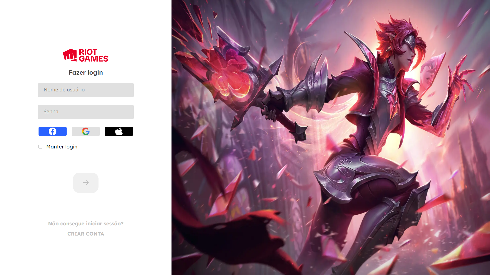
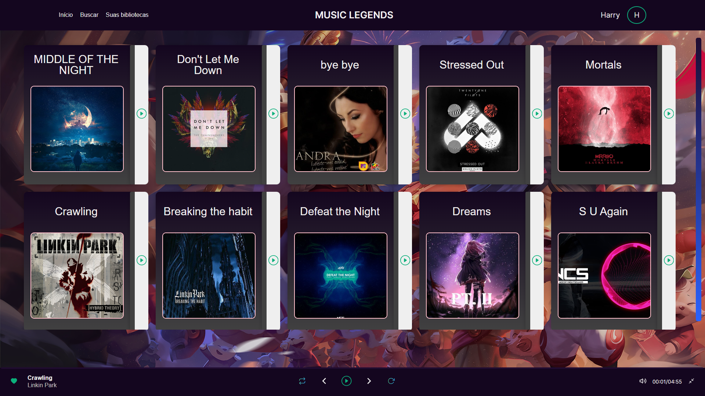
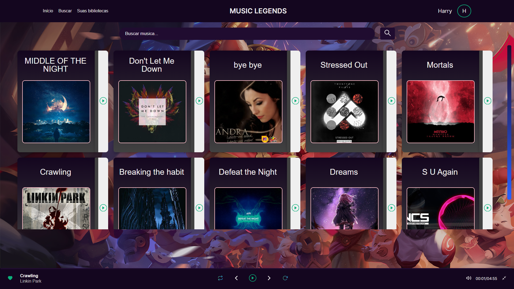
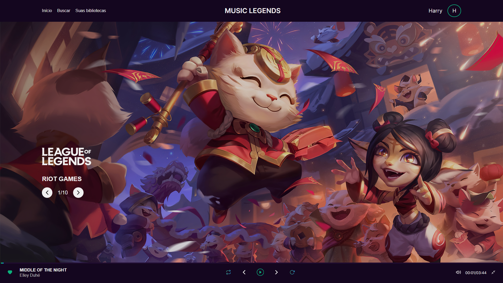
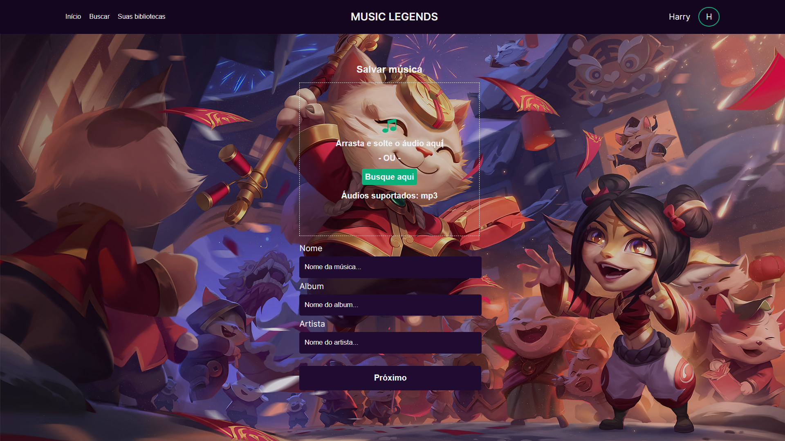
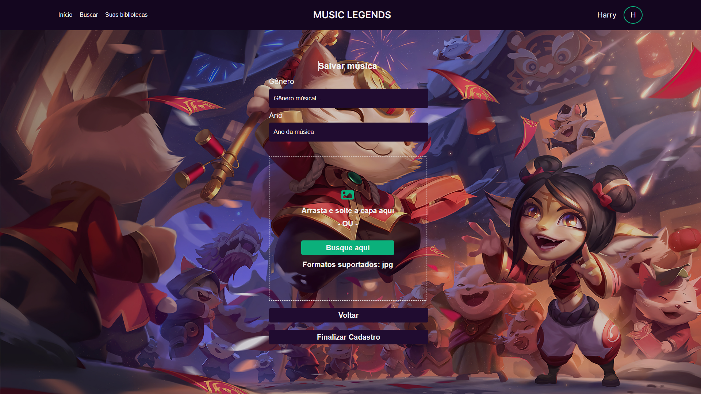
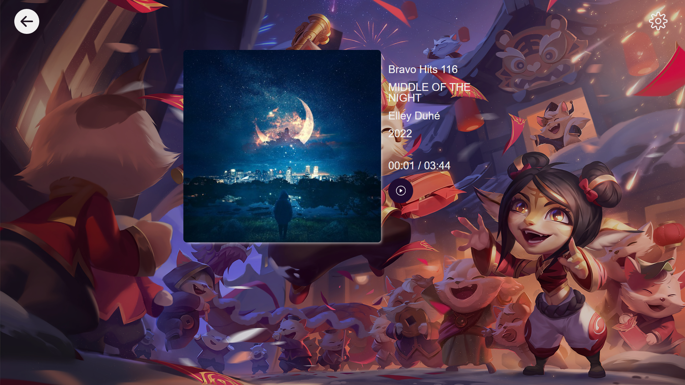
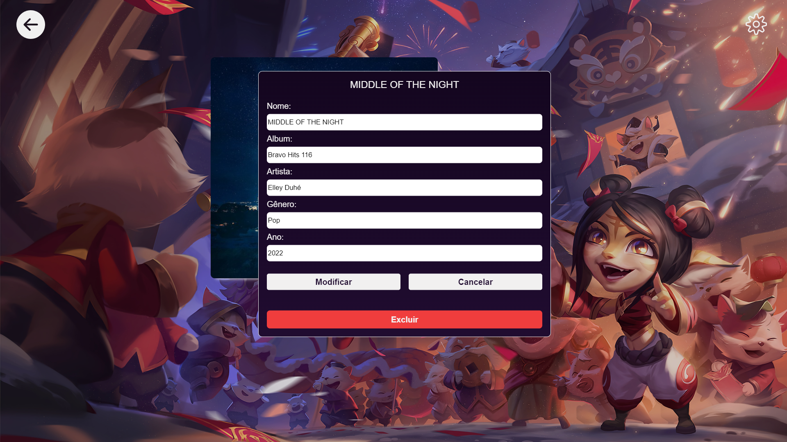
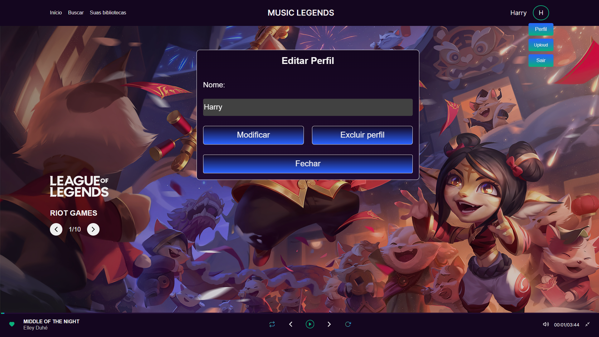
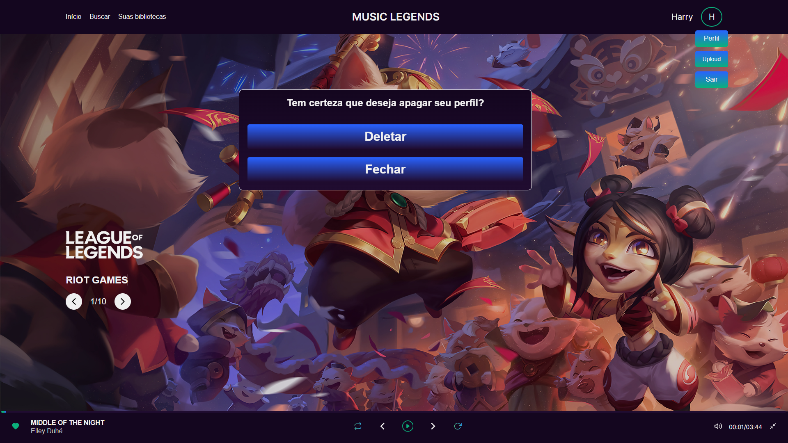

# RiotFy

## Seções do projeto

- [Descrição](#✔️-descrição)
- [Funcionalidades](#💻-funcionalidades)
- [Tecnologias](#🔨-tecnologias)
- [Instalação e Execução](#🚀-instalação-e-execução)
- [API](#💻-API)

## ✔️ Descrição

Riotfy é uma aplicação web sobre músicas com temática de League Of Legends, na qual é possivel reproduzir músicas, pausar, criar um usuário,criar músicas, editar músicas e usuário, e excluir uma música e um usuário.
O figma como algumas partes do designer do projeto não foi feita por mim, <a href="https://www.figma.com/file/ncArmqcunPAxj6t8TMl6uR/Desafios---Codel%C3%A2ndia-(Copy)?type=design&node-id=80254-762&mode=design&t=1nGV82Y291rVWMrK-0" target="_blank">aqui</a> você pode estar encontrando o link do figma do projeto <a href="https://www.figma.com/file/ncArmqcunPAxj6t8TMl6uR/Desafios---Codel%C3%A2ndia-(Copy)?type=design&node-id=80254-762&mode=design&t=1nGV82Y291rVWMrK-0" target="_blank">(Desafio 23)</a>.

## 💻 Funcionalidades

- Cadastro de usuário;


- Login;



- Página inicial;



- Página de busca;



- Página de bibliotecas;



- Página de criação de músicas, apenas admin;





- Página de visualização de música por id;



- Página de edição e exclução de músicas, apenas admin;



- Modal de edição e exclução de usuário;





## 🔨 Tecnologias

- `npm`
- `Vercel`
- `NextJs14`
- `Typescript`
- `Git`
- `Github`
- `Figma`
- `Axios`
- `Sass`
- `Toastify`
- `Hook Form`
- `Nookies`
- `ESLint`
- `Zod`
- `React-dropzone`
- `React-icons`
- `Rc-slider`

## 🚀 Instalação e Execução

É necessário ter instalado em sua máquina o `Node.Js` e o gerenciador de pacotes `npm`.
Para executar a aplicação localmente, siga estas etapas:

1.  Clone este repositório;
2.  Abra o repositório no `vscode` e abra um terminal para as instalação das dependências;
3.  Rode os seguintes comandos no terminal:

         npm install
         npm run dev

4.  Abra seu navegador e acesse o servidor pelo seguinte link:

        http://localhost:3000

5.  Se o backEnd estiver ativo, acesse por esse link:

        http://localhost:3001

## 💻 API

## Seções da api

- [Instalação e Execução](#🔨-Instalação-e-Execução)
- [Rotas da API](#🔨-Rotas-da-API)

## 🔨 Instalação e Execução

É necessário ter instalado em sua máquina o `Node.Js` e o gerenciador de pacotes `npm`.
Para executar a aplicação localmente, siga estas etapas:

1. Clone este repositório.
2. Abra o repositório no vscode. Abra um terminal para as instalações e um terminal para o postgreSQL.
3. No terminal para o PostgreSQL, digite psql, faça o login e crie um banco de dados (CREATE DATABASE [nome do banco];).
4. Configure as credenciais de acesso num novo arquivo `.env`, seguindo o exemplo em .env.example. Em /db, substituia por /[nome do banco].
5. Rode os comandos:

```
    npm install
    npm install --save @nestjs/config swagger class-validator class-transformer
    npm install prisma -D
    npm install @prisma/client
    npx prisma migrate dev
    npm run start:dev
```

## 🔨 Rotas da API

| Método | Endpoint    | Responsabilidade             | Autenticação                          |
| ------ | ----------- | ---------------------------- | ------------------------------------- |
| POST   | /login      | Gera o token de autenticação | Qualquer usuário, não necessita token |
| GET    | /users      | Busca usuário por token      | Qualquer usuário, obrigatório token   |
| POST   | /users      | Criação de usuário           | Qualquer usuário, não necessita token |
| PATCH  | /users/:id  | Atualiza um usuário          | Obrigatório token e dono da conta     |
| DELETE | /users/:id  | Deletar usuário              | Obrigatório token e dono da conta     |
| POST   | /musics     | Criação da música            | Usuário admin, obrigatório token      |
| GET    | /musics     | Lista todas as músicas       | Qualquer usuário, não necessita token |
| GET    | /musics/:id | Retornar uma música por id   | Qualquer usuário, não necessita token |
| PATCH  | /musics/:id | Atualiza uma música por id   | Usuário admin, obrigatório token      |
| DELETE | /musics/:id | Deletar música por id        | Usuário admin, obrigatório token      |

### **POST - /login**

Rota de login do usuário.

**Url da requisição**: `http://localhost:3000/login`

| Dados de Envio:    |
| ------------------ |
| Body: Formato Json |

```json
{
  "email": "harry@email.com",
  "password": "12345678"
}
```

| Resposta do servidor:                          |
| ---------------------------------------------- |
| Body: Formato Json                             |
| Status code: <b style="color:green">200 OK</b> |

```json
{
  "token": "eyJhbGciOiJIUzI1NiIsInR5cCI6IkpXVCJ9.eyJlbWFpbCI6InJhZmFlbEBlbWFpbC5jb20iLCJpYXQiOjE2OTAzMTU1MzIsImV4cCI6MTY5MDkyMDMzMiwic3ViIjoiYTk1NWRjZDctMDQxNS00MzQ3LTgxMDEtYjdkNTJmNzM0ODFjIn0"
}
```

### **GET - /users**

Rota de listagem de usuário logado.

**Url da requisição**: `http://localhost:3000/users`

| Resposta do servidor:                          |
| ---------------------------------------------- |
| Body: Formato Json                             |
| Status code: <b style="color:green">200 OK</b> |

```json
{
  "id": "edf4d8f7-3094-42d9-8d70-8198201b80d4",
  "name": "Harry",
  "email": "harry@email.com"
}
```

### **POST - /users**

Rota de criação de usuário admin.

**Url da requisição**: `http://localhost:3000/users`

| Dados de Envio:    |
| ------------------ |
| Body: Formato Json |

```json
{
  "name": "Harry",
  "email": "harry@email.com",
  "password": "12345678",
  "admin": true
}
```

| Resposta do servidor:                               |
| --------------------------------------------------- |
| Body: Formato Json                                  |
| Status code: <b style="color:green">201 CREATED</b> |

```json
{
  "id": "edf4d8f7-3094-42d9-8d70-8198201b80d4",
  "name": "Harry",
  "email": "harry@email.com",
  "admin": true
}
```

### **POST - /users**

Rota de criação de usuário comum.

**Url da requisição**: `http://localhost:3000/users`

| Dados de Envio:    |
| ------------------ |
| Body: Formato Json |

```json
{
  "name": "Harry",
  "email": "harry1@email.com",
  "password": "12345678"
}
```

| Resposta do servidor:                               |
| --------------------------------------------------- |
| Body: Formato Json                                  |
| Status code: <b style="color:green">201 CREATED</b> |

```json
{
  "id": "edf4d8f7-3094-42d9-8d70-8198201b80d4",
  "name": "Harry",
  "email": "harry1@email.com"
}
```

### **PATCH - /users/:id**

Atualizar o úsuário dono da conta pelo id recebido nos parâmetros da rota.

**Url da requisição**: `http://localhost:3000/users/edf4d8f7-3094-42d9-8d70-8198201b80d4`

| Dados de Envio:    |
| ------------------ |
| Body: Formato Json |

```json
{
  "name": "Harry Potter",
  "email": "harrypotter@mail.com"
}
```

| Resposta do servidor:                          |
| ---------------------------------------------- |
| Body: Formato Json                             |
| Status code: <b style="color:green">200 OK</b> |

```json
{
  "id": "edf4d8f7-3094-42d9-8d70-8198201b80d4",
  "name": "Harry Potter",
  "email": "harrypotter@mail.com"
}
```

### **DELETE - /users/:id**

Deletar o úsuário dono da conta pelo id recebido nos parâmetros da rota.

**Url da requisição**: `http://localhost:3000/users/edf4d8f7-3094-42d9-8d70-8198201b80d4`

| Resposta do servidor:                                  |
| ------------------------------------------------------ |
| Body: **Nenhum body deve ser retornado**               |
| Status code: <b style="color:green">204 NO CONTENT</b> |

```json

```

### **POST - /musics**

Rota de criação de música.

**Url da requisição**: `http://localhost:3000/musics`

| Dados de Envio:    |
| ------------------ |
| Body: Formato Json |

```json
{
  "name": "As We Fall",
  "album": "As We Fall",
  "artist": "League of Legends",
  "genre": "Alternativa/indie",
  "year": "2017"
}
```

| Resposta do servidor:                               |
| --------------------------------------------------- |
| Body: Formato Json                                  |
| Status code: <b style="color:green">201 CREATED</b> |

```json
{
  "id": "edf4d8f7-3094-42d9-8d70-8198201b80d4",
  "name": "As We Fall",
  "album": "As We Fall",
  "artist": "League of Legends",
  "genre": "Alternativa/indie",
  "year": "2017",
  "userId": "edf4d8f7-3094-42d9-8d70-8198201b80d4"
}
```

### **GET - /musics**

Rota de listagem de todos as músicas.

**Url da requisição**: `http://localhost:3000/musics`

| Resposta do servidor:                          |
| ---------------------------------------------- |
| Body: Formato Json                             |
| Status code: <b style="color:green">200 OK</b> |

```json
[
  {
    "id": "edf4d8f7-3094-42d9-8d70-8198201b80d4",
    "name": "As We Fall",
    "album": "As We Fall",
    "artist": "League of Legends",
    "genre": "Alternativa/indie",
    "year": "2017",
    "userId": "edf4d8f7-3094-42d9-8d70-8198201b80d4"
  },
  {
    "id": "edf4d8f7-3094-42d9-8d70-8198201b80d4",
    "name": "As We Fall",
    "album": "As We Fall",
    "artist": "League of Legends",
    "genre": "Alternativa/indie",
    "year": "2017",
    "userId": "edf4d8f7-3094-42d9-8d70-8198201b80d4"
  },
  {
    "id": "edf4d8f7-3094-42d9-8d70-8198201b80d4",
    "name": "As We Fall",
    "album": "As We Fall",
    "artist": "League of Legends",
    "genre": "Alternativa/indie",
    "year": "2017",
    "userId": "edf4d8f7-3094-42d9-8d70-8198201b80d4"
  }
]
```

### **GET - /musics/:id**

Rota de listagem de música por id.

**Url da requisição**: `http://localhost:3000/musics/edf4d8f7-3094-42d9-8d70-8198201b80d4`

| Resposta do servidor:                          |
| ---------------------------------------------- |
| Body: Formato Json                             |
| Status code: <b style="color:green">200 OK</b> |

```json
{
  "id": "edf4d8f7-3094-42d9-8d70-8198201b80d4",
  "name": "As We Fall",
  "album": "As We Fall",
  "artist": "League of Legends",
  "genre": "Alternativa/indie",
  "year": "2017",
  "userId": "edf4d8f7-3094-42d9-8d70-8198201b80d4"
}
```

### **PATCH - /musics/:id**

Atualizar a música, id recebido nos parâmetros da rota.

**Url da requisição**: `http://localhost:3000/musics/edf4d8f7-3094-42d9-8d70-8198201b80d4`

| Dados de Envio:    |
| ------------------ |
| Body: Formato Json |

```json
{
  "name": "As We Fall modificado",
  "album": "As We Fall modificado",
  "artist": "League of Legends modificado",
  "genre": "Alternativa/indie modificado",
  "year": "201777"
}
```

| Resposta do servidor:                          |
| ---------------------------------------------- |
| Body: Formato Json                             |
| Status code: <b style="color:green">200 OK</b> |

```json
{
  "id": "edf4d8f7-3094-42d9-8d70-8198201b80d4",
  "name": "As We Fall modificado",
  "album": "As We Fall modificado",
  "artist": "League of Legends modificado",
  "genre": "Alternativa/indie modificado",
  "year": "201777",
  "userId": "edf4d8f7-3094-42d9-8d70-8198201b80d4"
}
```

### **DELETE - /musics/:id**

Deletar música, id recebido nos parâmetros da rota.

**Url da requisição**: `http://localhost:3000/musics/edf4d8f7-3094-42d9-8d70-8198201b80d4`

| Resposta do servidor:                                  |
| ------------------------------------------------------ |
| Body: **Nenhum body deve ser retornado**               |
| Status code: <b style="color:green">204 NO CONTENT</b> |
